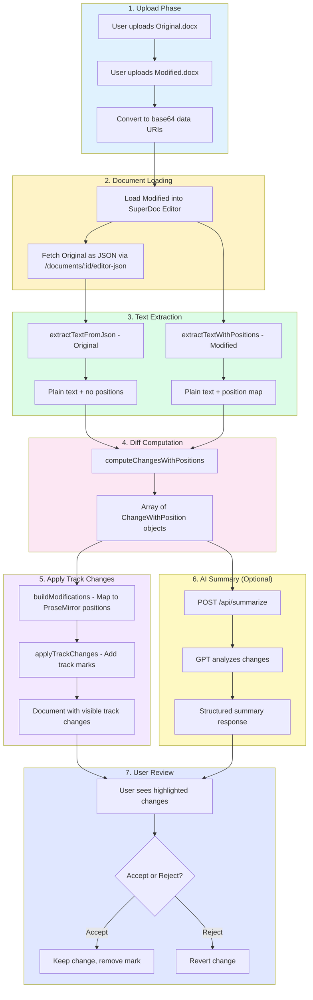
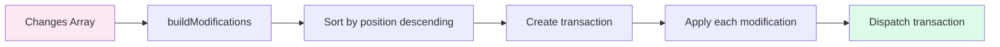
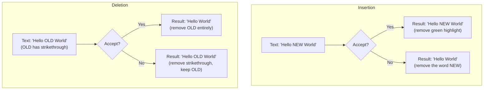

# Superdoc Document Comparison

A Next.js application that enables intelligent comparison between two DOCX document versions, highlighting changes with track changes functionality and providing AI-powered summaries.

## Table of Contents

- [What is This Project?](#what-is-this-project)
- [Key Features](#key-features)
- [Project Structure](#project-structure)
- [How Document Comparison Works](#how-document-comparison-works)
- [The Document-Diff Module](#the-document-diff-module)
- [Data Structures](#data-structures)
- [Integration with SuperDoc](#integration-with-superdoc)
- [Getting Started](#getting-started)
- [Environment Variables](#environment-variables)

---

## What is This Project?

This project solves a common problem: **comparing two versions of a Word document to see exactly what changed**. Think of it like "Git diff" but for `.docx` files.

When you upload two versions of a document (original and modified), the application:

1. **Detects all changes** - insertions, deletions, and replacements
2. **Visualizes them** - using Microsoft Word-style track changes (green for additions, red with strikethrough for deletions)
3. **Summarizes with AI** - GPT generates a human-readable summary of what changed and why it matters
4. **Lets you review** - accept or reject individual changes with one click

### Real-World Use Cases

- Legal teams reviewing contract revisions
- Editors comparing document drafts
- Compliance teams tracking policy changes
- Anyone who needs to understand "what changed between version A and version B"

---

## Key Features

| Feature | Description |
|---------|-------------|
| **Visual Diff** | Changes highlighted directly in the document with track changes styling |
| **AI Summary** | GPT-powered analysis explaining what changed in plain English |
| **Accept/Reject** | Review changes individually or accept/reject all at once |
| **Export** | Download the reviewed document with your decisions applied |
| **No Server Storage** | Documents are processed client-side; nothing is stored on servers |

---

## Project Structure

```
superdoc-diffing/
├── app/
│   ├── api/
│   │   └── summarize/
│   │       └── route.ts          # AI summarization API endpoint
│   │
│   ├── components/
│   │   ├── DocComparisonApp.tsx  # Main application component (upload flow)
│   │   ├── DocumentComparison.tsx # Document viewer with track changes
│   │   ├── DocumentUploader.tsx  # Drag-and-drop upload component
│   │   └── catalyst/             # UI component library (Tailwind UI)
│   │
│   ├── lib/
│   │   ├── document-diff/        # Core comparison logic (detailed below)
│   │   │   ├── index.ts          # Public API exports
│   │   │   ├── types.ts          # TypeScript type definitions
│   │   │   ├── text-extraction.ts # Extract text from documents
│   │   │   ├── diff-computation.ts # Compute changes between texts
│   │   │   └── track-changes.ts  # Apply track change marks
│   │   │
│   │   └── openai.ts             # AI configuration and prompts
│   │
│   ├── types/
│   │   └── index.ts              # Shared TypeScript types
│   │
│   ├── globals.css               # Global styles (dark theme, SuperDoc overrides)
│   ├── layout.tsx                # Root layout
│   └── page.tsx                  # Home page
│
├── public/                       # Static assets
├── package.json                  # Dependencies
└── README.md                     # You are here!
```

### Why This Structure?

- **`app/lib/document-diff/`**: Isolated, testable module for all comparison logic. Has no UI dependencies.
- **`app/components/`**: React components separated by responsibility (upload vs. comparison vs. UI primitives)
- **`app/api/`**: Next.js API routes for server-side operations (AI calls)
- **Colocation**: Related files are grouped together (e.g., types with their implementation)

---

## How Document Comparison Works

The comparison process follows a pipeline architecture. Here's the complete flow:



### Step-by-Step Explanation

#### Step 1-2: Upload & Load
When you upload two `.docx` files, they're converted to base64 strings. The **modified** document is loaded into SuperDoc's rich text editor. The **original** is fetched as JSON (SuperDoc provides an API endpoint for this).

#### Step 3: Text Extraction
We extract plain text from both documents, but differently:
- **Original**: Just the text (we don't need positions since we won't modify it)
- **Modified**: Text + a "position map" that tells us exactly where each character lives in the ProseMirror document

#### Step 4: Diff Computation
Using the `diff` library, we compare the two texts character-by-character. This gives us a list of changes (insertions, deletions, replacements) with their positions in the text.

#### Step 5: Apply Track Changes
This is where the magic happens. We translate text positions to ProseMirror positions and add track change marks (`trackInsert`, `trackDelete`) to the document. These marks make changes visible with colored highlighting.

#### Step 6: AI Summary
The changes are sent to GPT, which returns a structured analysis including:
- Document context (what type of document is this?)
- Overview of changes
- Categorized list of specific changes
- Human-readable summary

#### Step 7: Review
Users can click on any change to navigate to it, then accept (keep the change) or reject (revert to original).

---

## The Document-Diff Module

The `app/lib/document-diff/` module is the heart of the comparison system. Let's explore each file in detail.

### File Overview

```
document-diff/
├── index.ts           # Public API - what other code imports
├── types.ts           # All TypeScript interfaces
├── text-extraction.ts # Getting text out of documents
├── diff-computation.ts # Finding what changed
└── track-changes.ts   # Making changes visible
```

---

### `types.ts` - Data Structures

This file defines all the TypeScript types. Understanding these is key to understanding the system.

#### Change Types

```typescript
// The three types of changes we can detect
type ChangeType = "insertion" | "deletion" | "replacement";

// Basic change information
interface Change {
  id: string;        // Unique identifier like "change-0"
  type: ChangeType;  // What kind of change
  content: string;   // The text that was added/removed/changed to
  oldContent?: string; // For replacements: what it used to be
}

// Change with position information for applying to document
interface ChangeWithPosition extends Change {
  charStart?: number;    // Where this text starts in modified doc
  charEnd?: number;      // Where this text ends in modified doc
  insertAt?: number;     // For deletions: where to show the deleted text
  contextBefore?: string; // Text before the deletion (helps find position)
}
```

#### Position Mapping

```typescript
// Maps character index → ProseMirror position
interface PositionMap {
  text: string;              // The extracted text
  charToPos: number[];       // charToPos[5] = PM position of 5th character
}
```

**Why do we need position mapping?**

ProseMirror (the editor SuperDoc uses) doesn't count positions the same way a string does. In a string, position 5 is always the 6th character. In ProseMirror, position 5 might be inside a paragraph node, after formatting markers, etc.

```
String:      "Hello World"
             01234567890

ProseMirror: <doc><p>Hello World</p></doc>
             0   1 23456789...
             ^   ^ ^
             doc p text starts here
```

The `PositionMap` lets us translate from "character 5 in the text" to "position 8 in ProseMirror."

---

### `text-extraction.ts` - Getting Text Out

#### `extractTextFromJson(node)`

Extracts plain text from a ProseMirror JSON structure (the original document).

```typescript
// Input: ProseMirror JSON
{
  "type": "doc",
  "content": [
    {
      "type": "paragraph",
      "content": [
        { "type": "text", "text": "Hello " },
        { "type": "text", "text": "World", "marks": [{"type": "bold"}] }
      ]
    }
  ]
}

// Output: "Hello World"
```

**How it works:**
1. Recursively traverse the JSON tree
2. When we hit a text node, grab its `.text` property
3. Add newlines between block elements (paragraphs, headings)
4. Add spaces between table cells

#### `extractTextWithPositions(editor)`

Extracts text from a live ProseMirror editor AND builds a position map.

```typescript
const result = extractTextWithPositions(editor);
// result.text = "Hello World"
// result.charToPos = [5, 6, 7, 8, 9, 10, 11, 12, 13, 14, 15]
//                     ^  ^  ^  ^  ^  ^   ^   ^   ^   ^   ^
//                     H  e  l  l  o     W   o   r   l   d
```

**How it works:**
1. Use ProseMirror's `doc.descendants()` to visit every node
2. For each text node, record the ProseMirror position of each character
3. Track block boundaries to add newlines in the right places

---

### `diff-computation.ts` - Finding Changes

#### `computeChangesWithPositions(originalText, modifiedText)`

The core diffing function. Uses the `diff` library for character-level comparison.

```typescript
const original = "The quick brown fox";
const modified = "The fast brown dog";

const changes = computeChangesWithPositions(original, modified);

// Result:
[
  {
    id: "change-0",
    type: "replacement",
    content: "fast",           // New text
    oldContent: "quick",       // Old text
    charStart: 4,              // "fast" starts at position 4
    charEnd: 8                 // "fast" ends at position 8
  },
  {
    id: "change-1",
    type: "replacement",
    content: "dog",
    oldContent: "fox",
    charStart: 15,
    charEnd: 18
  }
]
```

**How it works:**

```
Original: "The quick brown fox"
Modified: "The fast brown dog"

diff library output:
  { value: "The ", added: false, removed: false }  ← unchanged
  { value: "quick", added: false, removed: true }  ← removed
  { value: "fast", added: true, removed: false }   ← added (replacement!)
  { value: " brown ", added: false, removed: false } ← unchanged
  { value: "fox", added: false, removed: true }    ← removed
  { value: "dog", added: true, removed: false }    ← added (replacement!)

We track position in modified text as we iterate:
  Position 0: "The " (4 chars) → advance to 4
  Position 4: "quick" removed, "fast" added → replacement at 4-8
  Position 8: " brown " (7 chars) → advance to 15
  Position 15: "fox" removed, "dog" added → replacement at 15-18
```

**Key insight**: When we see a removal immediately followed by an addition, that's a **replacement**, not separate deletion + insertion.

---

### `track-changes.ts` - Making Changes Visible

This is the most complex file. It applies the computed changes to the SuperDoc editor as track change marks.

#### Understanding Track Changes

SuperDoc (built on ProseMirror) supports "track changes" - a feature like Microsoft Word's revision tracking. There are two mark types:

- **`trackInsert`**: Marks text that was added (shown in green)
- **`trackDelete`**: Marks text that was removed (shown in red with strikethrough)

Each mark stores metadata:
```typescript
{
  id: "insert-change-0",
  author: "Comparison",
  authorEmail: "comparison@superdoc.diff",
  date: "2024-01-15T10:30:00.000Z"
}
```

#### `applyTrackChanges(editor, changes, posMap)`

Main entry point for applying changes to the document.



**Why sort by descending position?**

When you modify a document, positions shift. If you insert text at position 10, everything after position 10 moves forward. By applying changes from end to start, earlier changes don't affect the positions of later ones.

```
Document: "Hello World"
          0    5    10

Change 1: Insert "Beautiful " at position 6
Change 2: Insert "My " at position 0

If we apply in order (wrong):
  1. Insert at 0 → "My Hello World" (positions shift!)
  2. Insert at 6 → "My Hel Beautiful lo World" (WRONG!)

If we apply in reverse (correct):
  1. Insert at 6 → "Hello Beautiful World"
  2. Insert at 0 → "My Hello Beautiful World" (CORRECT!)
```

#### Handling Different Change Types

**Insertions:**
```typescript
// Mark existing text with trackInsert
tr.addMark(pmFrom, pmTo, trackInsertMark);
```
The text is already in the modified document; we just mark it as "new."

**Deletions:**
```typescript
// Insert the deleted text with trackDelete mark
const deletedTextNode = schema.text(deletedContent, [trackDeleteMark]);
tr.insert(pmFrom, deletedTextNode);
```
The deleted text isn't in the modified document, so we insert it back (with a strikethrough mark) to show what was removed.

**Replacements:**
Both operations: mark the new text as inserted, and insert the old text as deleted.

#### Position Mapping for Deletions

Deletions are tricky because the deleted text doesn't exist in the modified document. We use **context-based search**:

```typescript
// Original: "The quick brown fox jumps"
// Modified: "The brown fox jumps"
// Deletion: "quick "

// We can't say "deleted text was at position X" because it's not there!
// Instead, we find where it SHOULD go using context:

contextBefore = "The "  // Text before the deletion
searchResults = editor.commands.search("The ");
insertPosition = searchResults[0].to;  // Insert after "The "
```

---

### `approveChange` and `rejectChange`

These functions handle user decisions:

**Accept a change:**
- For insertions: Remove the `trackInsert` mark (text stays)
- For deletions: Delete the `trackDelete`-marked text (it was already "deleted")

**Reject a change:**
- For insertions: Delete the `trackInsert`-marked text (undo the addition)
- For deletions: Remove the `trackDelete` mark (keep the "deleted" text)



---

## Data Structures

Here's a visual representation of the key data flowing through the system:

```
┌─────────────────────────────────────────────────────────────────┐
│                        ChangeWithPosition                        │
├─────────────────────────────────────────────────────────────────┤
│  id: "change-0"                                                 │
│  type: "replacement"                                            │
│  content: "new text"        ← What's in the modified doc        │
│  oldContent: "old text"     ← What was in the original doc      │
│  charStart: 15              ← Start position in modified text    │
│  charEnd: 23                ← End position in modified text      │
└─────────────────────────────────────────────────────────────────┘
                                    │
                                    ▼
┌─────────────────────────────────────────────────────────────────┐
│                      DocumentModification                        │
├─────────────────────────────────────────────────────────────────┤
│  change: ChangeWithPosition ← Reference to the change           │
│  pmFrom: 42                 ← ProseMirror start position         │
│  pmTo: 58                   ← ProseMirror end position           │
│  isDeletion: false          ← Is this a deletion operation?      │
│  contextRange: {from, to}   ← Where to copy formatting from      │
└─────────────────────────────────────────────────────────────────┘
                                    │
                                    ▼
┌─────────────────────────────────────────────────────────────────┐
│                      Track Change Mark                           │
├─────────────────────────────────────────────────────────────────┤
│  type: "trackInsert" | "trackDelete"                            │
│  attrs: {                                                        │
│    id: "insert-change-0"                                        │
│    author: "Comparison"                                          │
│    authorEmail: "comparison@superdoc.diff"                      │
│    date: "2024-01-15T10:30:00.000Z"                            │
│  }                                                               │
└─────────────────────────────────────────────────────────────────┘
```

---

## Integration with SuperDoc

[SuperDoc](https://github.com/Harbour-Enterprises/SuperDoc) is an open-source document editor built on ProseMirror/TipTap. Here's how we integrate with it:

### What SuperDoc Provides

1. **DOCX Rendering**: Loads and displays Word documents in the browser
2. **ProseMirror Foundation**: Rich text editing with a document model
3. **Track Changes Schema**: Built-in `trackInsert` and `trackDelete` mark types
4. **Search Command**: `editor.commands.search()` for finding text
5. **Export**: Download the document as DOCX

### What We Build On Top

1. **Comparison Logic**: Diffing two documents (SuperDoc doesn't do this)
2. **Programmatic Track Changes**: Applying marks via transactions (SuperDoc's UI commands expect user interaction)
3. **Position Mapping**: Translating text positions to ProseMirror positions
4. **Accept/Reject Flow**: Custom implementation because SuperDoc's native commands don't work with programmatically-created marks

### Key Integration Points

```typescript
// 1. Access the editor instance
const editor = superdoc.activeEditor as SuperDocEditor;

// 2. Get document as JSON (for original document)
const json = await fetch(`/documents/${id}/editor-json`).then(r => r.json());

// 3. Access ProseMirror state and schema
const { state, schema, view } = editor;

// 4. Get track change mark types
const trackInsertMark = schema.marks.trackInsert;
const trackDeleteMark = schema.marks.trackDelete;

// 5. Create and dispatch transactions
let tr = state.tr;
tr = tr.addMark(from, to, trackInsertMark.create({...}));
view.dispatch(tr);

// 6. Use search for positioning
const results = editor.commands.search("context text");
```

---

## Getting Started

### Prerequisites

- Node.js 18+
- pnpm (recommended) or npm
- OpenAI API key (for AI summaries)

### Installation

```bash
# Clone the repository
git clone <repository-url>
cd superdoc-diffing

# Install dependencies
pnpm install

# Set up environment variables
cp .env.example .env.local
# Edit .env.local and add your OpenAI API key
```

### Running the Application

```bash
# Development mode (with hot reload)
pnpm dev

# Production build
pnpm build
pnpm start
```

Open [http://localhost:3000](http://localhost:3000) in your browser.

### Running Tests

```bash
# Run all tests
pnpm test

# Watch mode (re-run on file changes)
pnpm test:watch

# With UI
pnpm test:ui
```

---

## Environment Variables

Create a `.env.local` file in the project root:

```env
# Required for AI summaries
OPENAI_API_KEY=sk-your-api-key-here
```

| Variable | Required | Description |
|----------|----------|-------------|
| `OPENAI_API_KEY` | Yes* | Your OpenAI API key for GPT summaries |

*The app works without this, but AI summaries will be disabled.

---

## Tech Stack

| Technology | Purpose |
|------------|---------|
| [Next.js 15](https://nextjs.org/) | React framework with App Router |
| [SuperDoc](https://github.com/Harbour-Enterprises/SuperDoc) | DOCX editor (ProseMirror-based) |
| [ProseMirror](https://prosemirror.net/) | Rich text editing toolkit |
| [diff](https://www.npmjs.com/package/diff) | Text diffing algorithm |
| [Vercel AI SDK](https://sdk.vercel.ai/) | AI integration with structured output |
| [Tailwind CSS](https://tailwindcss.com/) | Utility-first CSS |
| [Motion](https://motion.dev/) | Animation library |
| [Vitest](https://vitest.dev/) | Testing framework |

---

## AI-Assisted Development

This project was developed with AI assistance as a coding companion. Specifically, AI tools were used for:

- **Documentation**: Generating and refining technical documentation, including this README
- **Code Review**: Getting suggestions for edge cases and potential improvements
- **Debugging**: Troubleshooting complex ProseMirror position mapping issues
- **Boilerplate**: Accelerating repetitive tasks like TypeScript type definitions

The core architecture decisions, algorithm design, and implementation logic were human-driven. AI served as a productivity multiplier rather than a replacement for engineering judgment.

---

## License

MIT

---

## Contributing

Contributions are welcome! Please read the existing code and tests before submitting PRs.

For questions about the document-diff module, start with `app/lib/document-diff/index.ts` and follow the exports to understand the public API.
