# How Document Diffing Works

> A step-by-step guide explaining exactly how we compare two DOCX documents and visualize the differences.

---

## Overview

We compare two documents by:
1. Loading both documents into SuperDoc editors
2. Extracting plain text from each
3. Running a character-level diff algorithm
4. Mapping text changes back to document positions
5. Applying visual track change marks

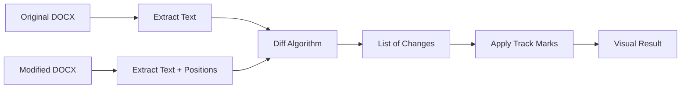

---

## Step 1: Loading the Documents

We create two SuperDoc instances - one visible, one hidden.

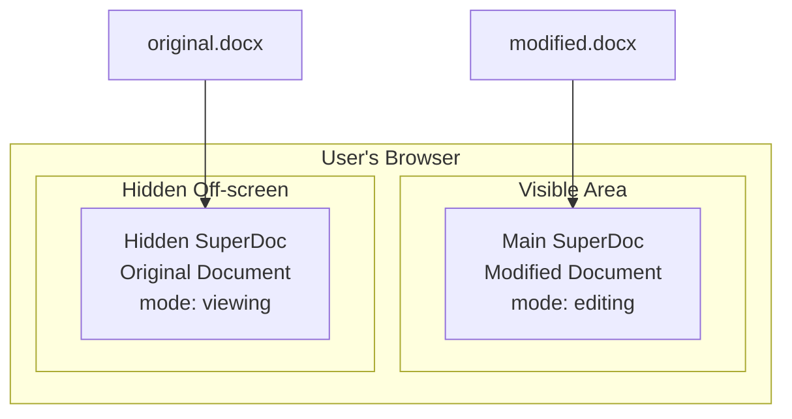

### Why Two Instances?

| Instance | Document | Purpose |
|----------|----------|---------|
| **Main** (visible) | Modified | User sees this, we apply track changes here |
| **Hidden** (off-screen) | Original | Only used to extract text for comparison |

### Code Location
```
DocumentComparison.tsx → useEffect() → lines 150-179
```

```typescript
// Main SuperDoc - shows MODIFIED document
mainSuperdoc = new SuperDoc({
  selector: "#superdoc-main",
  documents: [{ data: modifiedBase64, type: "docx" }],
  documentMode: "editing",
});

// Hidden SuperDoc - loads ORIGINAL document
hiddenSuperdoc = new SuperDoc({
  selector: "#superdoc-hidden",  // positioned off-screen with CSS
  documents: [{ data: originalBase64, type: "docx" }],
  documentMode: "viewing",
});
```

---

## Step 2: Extracting Text from Documents

Once both documents are loaded, we extract plain text from each.

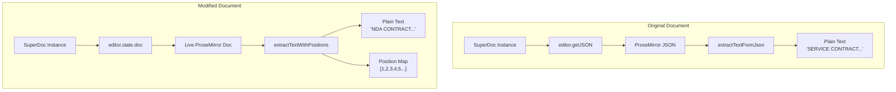

### What is the Position Map?

The position map is crucial - it maps each character in our extracted text to its ProseMirror position.

```
Extracted text:    N   D   A       C   O   N   T   R   A   C   T
Character index:   0   1   2   3   4   5   6   7   8   9   10  11

ProseMirror pos:   1   2   3   4   5   6   7   8   9   10  11  12
                   ↑
                   Position 0 is the document start node
```

### Why Do We Need Position Mapping?

ProseMirror uses a different position system than plain character indices:

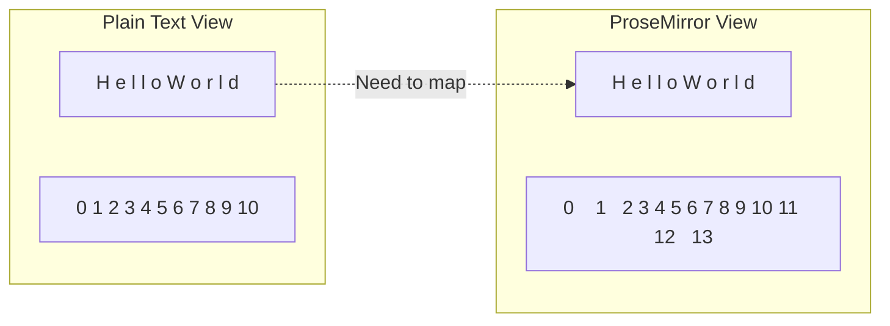

Every structural element (paragraph, table cell, etc.) takes up position space.

### Code Location
```
text-extraction.ts → extractTextFromJson() and extractTextWithPositions()
```

```typescript
// For ORIGINAL: Just extract text from JSON
function extractTextFromJson(json: ProseMirrorJsonNode): string {
  let text = "";
  // Recursively walk the JSON tree
  if (json.text) {
    text += json.text;
  }
  if (json.content) {
    for (const child of json.content) {
      text += extractTextFromJson(child);
    }
  }
  return text;
}

// For MODIFIED: Extract text AND build position map
function extractTextWithPositions(editor: SuperDocEditor): PositionMap {
  const text: string[] = [];
  const charToPos: number[] = [];

  editor.state.doc.descendants((node, pos) => {
    if (node.isText && node.text) {
      for (let i = 0; i < node.text.length; i++) {
        text.push(node.text[i]);
        charToPos.push(pos + i);  // Map char index → PM position
      }
    }
  });

  return { text: text.join(""), charToPos };
}
```

---

## Step 3: Computing the Diff

We use the `diff` library's `diffChars` function to find character-level differences.

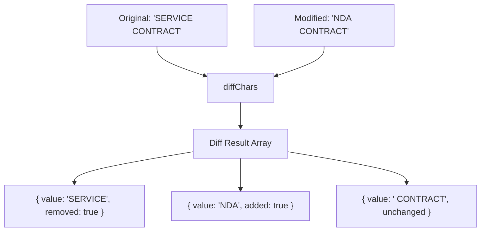

### Diff Result Types

| Property | Meaning |
|----------|---------|
| `added: true` | Text exists in MODIFIED but not in ORIGINAL |
| `removed: true` | Text exists in ORIGINAL but not in MODIFIED |
| Neither | Text is the same in both (unchanged) |

### Tracking Positions During Diff

As we iterate through diff results, we track our position in the modified text:

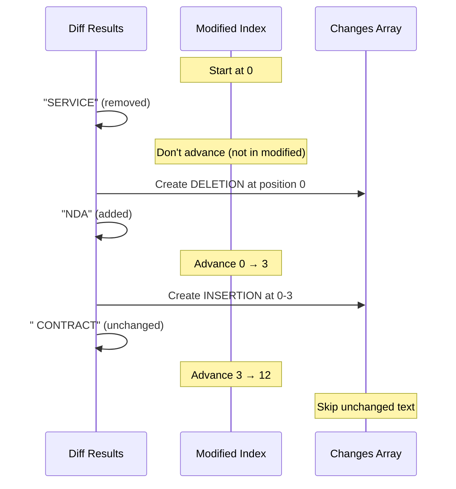

### Code Location
```
diff-computation.ts → computeChangesWithPositions()
```

```typescript
function computeChangesWithPositions(
  originalText: string,
  modifiedText: string
): ChangeWithPosition[] {
  const diffs = diffChars(originalText, modifiedText);
  const changes: ChangeWithPosition[] = [];
  let modifiedCharIndex = 0;  // Track position in modified text

  for (const diff of diffs) {
    if (!diff.added && !diff.removed) {
      // Unchanged - just advance position
      modifiedCharIndex += diff.value.length;
      continue;
    }

    if (diff.added) {
      // INSERTION: text in modified but not original
      changes.push({
        type: "insertion",
        content: diff.value,
        charStart: modifiedCharIndex,
        charEnd: modifiedCharIndex + diff.value.length,
      });
      modifiedCharIndex += diff.value.length;
    }

    if (diff.removed) {
      // DELETION: text in original but not modified
      changes.push({
        type: "deletion",
        content: diff.value,
        insertAt: modifiedCharIndex,  // Where it WOULD be in modified
      });
      // Don't advance - deletions aren't in modified text
    }
  }

  return changes;
}
```

---

## Step 4: Detecting Replacements

When a deletion is immediately followed by an insertion, we combine them into a "replacement":

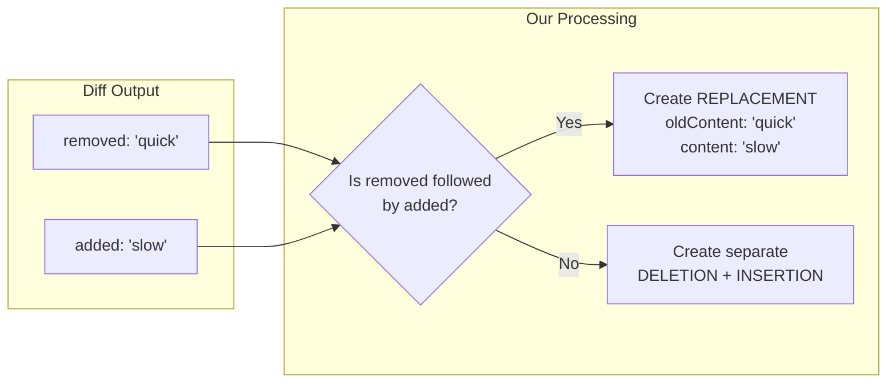

### Example

```
Original: "The quick brown fox"
Modified: "The slow red fox"

Diff results:
1. "The " (unchanged)
2. "quick" (removed)  ─┐
3. "slow" (added)     ─┴─► Combined into REPLACEMENT
4. " " (unchanged)
5. "brown" (removed)  ─┐
6. "red" (added)      ─┴─► Combined into REPLACEMENT
7. " fox" (unchanged)

Final changes:
- REPLACEMENT: "quick" → "slow" at position 4-8
- REPLACEMENT: "brown" → "red" at position 9-12
```

---

## Step 5: Mapping to ProseMirror Positions

Now we convert character positions to ProseMirror positions using our position map.

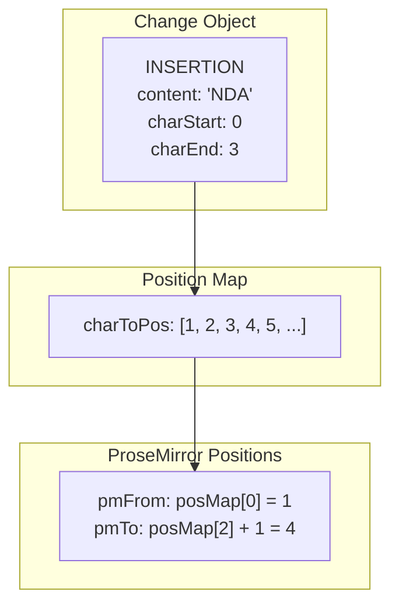

### Code Location
```
track-changes.ts → buildModifications()
```

```typescript
function buildModifications(
  editor: SuperDocEditor,
  changes: ChangeWithPosition[],
  posMap: PositionMap
): DocumentModification[] {
  const modifications = [];

  for (const change of changes) {
    if (change.type === "insertion" || change.type === "replacement") {
      // Map character positions to ProseMirror positions
      const pmFrom = posMap.charToPos[change.charStart];
      const pmTo = posMap.charToPos[change.charEnd - 1] + 1;

      modifications.push({
        change,
        pmFrom,
        pmTo,
      });
    }

    if (change.type === "deletion") {
      // For deletions, find where to INSERT the deleted text
      const pmInsertAt = posMap.charToPos[change.insertAt];

      modifications.push({
        change,
        pmFrom: pmInsertAt,
        pmTo: pmInsertAt,
        isDeletion: true,
      });
    }
  }

  return modifications;
}
```

---

## Step 6: Applying Track Change Marks

Finally, we apply visual marks to the document using ProseMirror transactions.

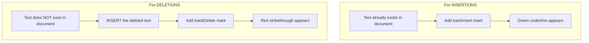

### Why We INSERT Deleted Text

This is a key concept:

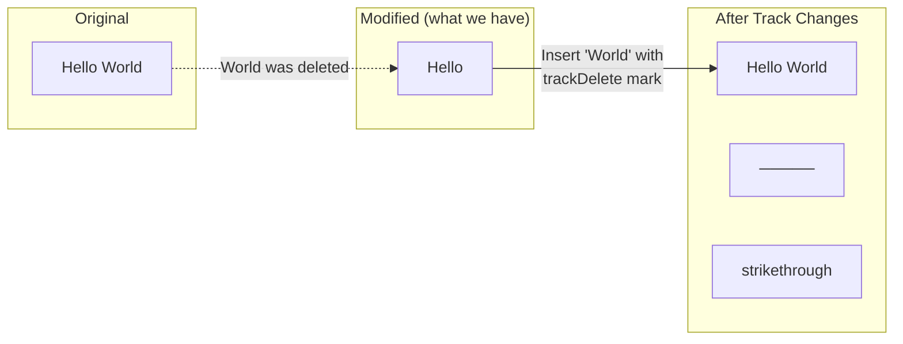

We need to INSERT the deleted text back into the document so users can SEE what was removed.

### Applying Changes in Reverse Order

We apply changes from END to START to avoid position shifting:

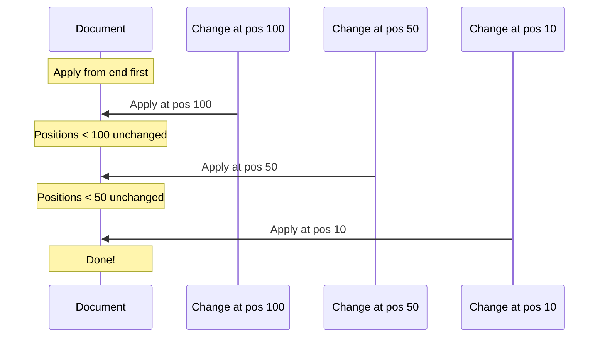

If we applied from START, inserting text at position 10 would shift everything after it, making positions 50 and 100 incorrect.

### Code Location
```
track-changes.ts → applyTrackChanges()
```

```typescript
function applyTrackChanges(
  editor: SuperDocEditor,
  changes: ChangeWithPosition[],
  posMap: PositionMap
): TrackChangesResult {
  // Get mark types from schema
  const trackInsertMark = editor.schema.marks.trackInsert;
  const trackDeleteMark = editor.schema.marks.trackDelete;

  // Build modifications with ProseMirror positions
  const modifications = buildModifications(editor, changes, posMap);

  // IMPORTANT: Sort by position DESCENDING (end to start)
  const sortedMods = modifications.sort((a, b) => b.pmFrom - a.pmFrom);

  // Create a single transaction for all changes
  let tr = editor.state.tr;

  for (const mod of sortedMods) {
    if (mod.change.type === "insertion") {
      // Add trackInsert mark to existing text
      const mark = trackInsertMark.create({ author: "Comparison" });
      tr = tr.addMark(mod.pmFrom, mod.pmTo, mark);
    }

    if (mod.change.type === "deletion") {
      // INSERT the deleted text with trackDelete mark
      const mark = trackDeleteMark.create({ author: "Comparison" });
      const textNode = editor.schema.text(mod.change.content, [mark]);
      tr = tr.insert(mod.pmFrom, textNode);
    }
  }

  // Apply all changes at once
  editor.view.dispatch(tr);
}
```

---

## Complete Flow Diagram

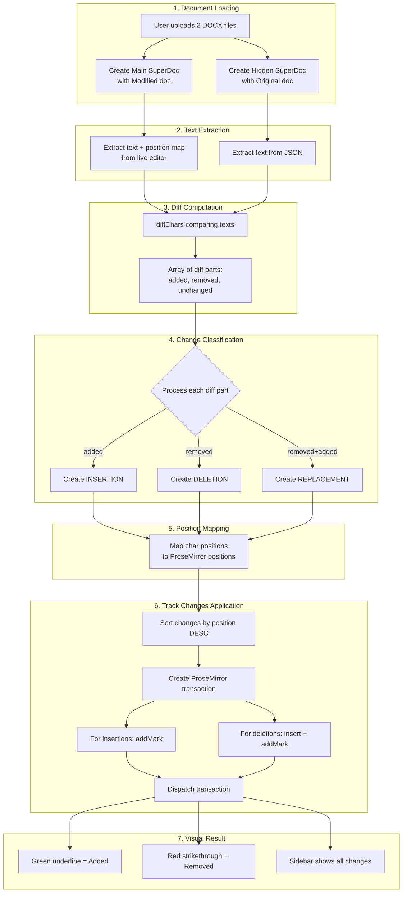

---

## Data Structures

### ChangeWithPosition

```typescript
interface ChangeWithPosition {
  id: string;                    // Unique identifier
  type: "insertion" | "deletion" | "replacement";
  content: string;               // The changed text
  oldContent?: string;           // For replacements: the original text

  // For insertions/replacements (positions in modified text):
  charStart?: number;
  charEnd?: number;

  // For deletions (where to insert in modified text):
  insertAt?: number;
  contextBefore?: string;        // Text before deletion for positioning
}
```

### PositionMap

```typescript
interface PositionMap {
  text: string;                  // Extracted plain text
  charToPos: number[];           // charToPos[charIndex] = prosemirrorPosition
}
```

### DocumentModification

```typescript
interface DocumentModification {
  change: ChangeWithPosition;    // The original change
  pmFrom: number;                // ProseMirror start position
  pmTo: number;                  // ProseMirror end position
  isDeletion?: boolean;          // Whether this is a deletion
}
```

---

## Example Walkthrough

Let's trace through a complete example:

### Input Documents

**Original:** `"Hello World"`
**Modified:** `"Hello Everyone"`

### Step-by-Step

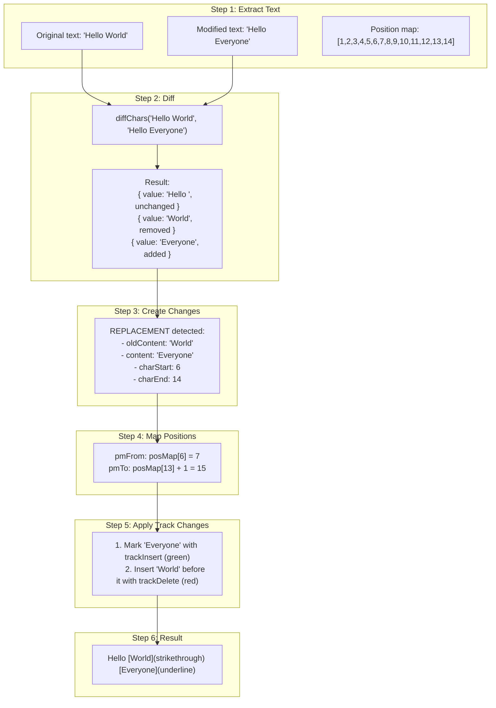

---

## Key Insights

### 1. We Show the MODIFIED Document
The user sees the modified document with track changes applied, not the original.

### 2. Deletions Are Inserted Back
To show what was deleted, we INSERT the deleted text with a strikethrough mark.

### 3. Position Mapping Is Critical
ProseMirror positions ≠ character indices. Always use the position map.

### 4. Apply Changes in Reverse Order
Process from end to start to avoid position shifting.

### 5. Single Transaction for All Changes
Apply all changes in one transaction for performance and atomicity.

---

## File Reference

| File | Purpose |
|------|---------|
| `DocumentComparison.tsx` | Main component, orchestrates everything |
| `text-extraction.ts` | `extractTextFromJson`, `extractTextWithPositions` |
| `diff-computation.ts` | `computeChangesWithPositions`, change creation |
| `track-changes.ts` | `applyTrackChanges`, ProseMirror transaction handling |
| `types.ts` | TypeScript interfaces for all data structures |
